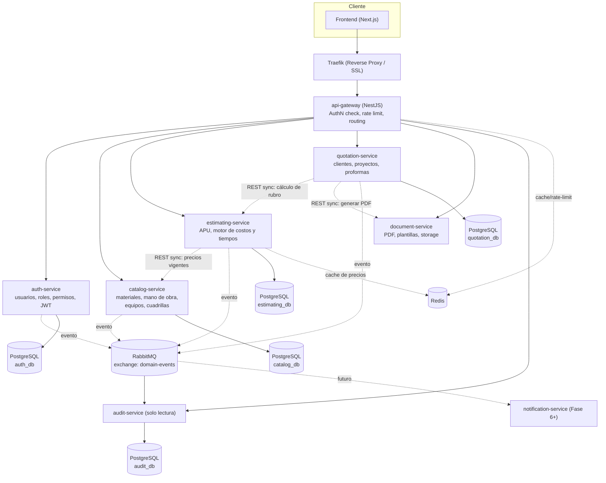
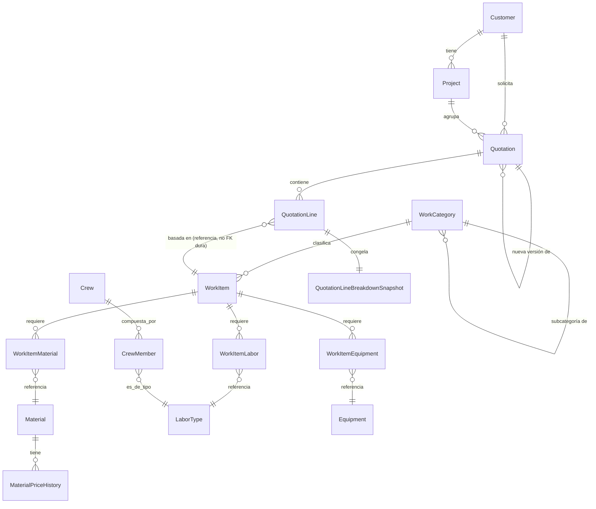
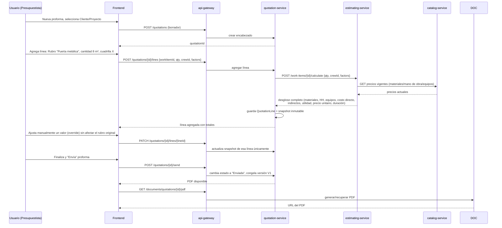

# Sistema de Proformas, Presupuestos y Cotizaciones Técnicas
## FASE 0 — Arquitectura y Diseño del Sistema

> Estado: **Diseño aprobado para iniciar Fase 1**
> Este documento es la fuente de verdad de arquitectura. No se debe iniciar programación de un módulo sin haber leído la sección correspondiente aquí.

---

## 1. Análisis funcional

El sistema reemplaza un proceso manual (hoja de cálculo) de elaboración de proformas para una empresa multi-especialidad (construcción civil, cerrajería, estructuras metálicas, soldadura, CCTV, redes/cableado estructurado, instalaciones eléctricas).

El núcleo funcional no es "un CRUD de proformas" — es un **motor de estimación técnica** que, a partir de una receta configurable (APU) y una cantidad, deriva de forma determinística:

- Lista de materiales y cantidades (con desperdicio).
- Horas-hombre por rol y su costo.
- Horas de equipo y su costo.
- Costo directo → indirecto → utilidad → descuento → impuesto → precio final.
- Esfuerzo (horas-hombre) y duración calendario (días), sensibles a la cuadrilla asignada y a factores de dificultad/condición.

Todo lo anterior debe ser **configurable sin tocar código** (coeficientes, factores, tarifas, porcentajes), y toda proforma emitida debe quedar **congelada** (snapshot) respecto a los precios/parámetros usados en el momento de creación, independientemente de cambios futuros en el catálogo.

Actores: Administrador, Gerencia, Presupuestista, Técnico, Vendedor, Consulta (solo lectura).

---

## 2. Arquitectura recomendada

**Estilo:** microservicios, cada uno con su propia base de datos lógica (esquema/DB propia dentro de la misma instancia física de PostgreSQL para eficiencia de recursos en un único VPS), comunicación síncrona vía REST/JSON para consultas de negocio y **un único bus de eventos (RabbitMQ)** para lo que realmente necesita desacoplamiento: auditoría y, más adelante, notificaciones.

**Decisión de consolidación (evitando microservicios innecesarios):**

El enunciado original proponía 9 servicios. Para el MVP se consolidan a **6 servicios + Gateway**, preservando límites de dominio claros para poder separar más adelante sin reescritura:

| Servicio original propuesto | Decisión Fase 0–6 | Justificación |
|---|---|---|
| auth-service | Se mantiene independiente | Frontera de seguridad crítica; JWT/roles son transversales a todo. |
| customer-service | **Fusionado** dentro de `quotation-service` (módulo `customers`) | El CRM es simple (CRUD) y su único consumidor real hoy es la proforma. Separarlo ahora obliga a llamadas de red por algo que cambia poco. |
| catalog-service | Se mantiene independiente | Maestro de datos (materiales, mano de obra, equipos, cuadrillas) consumido por varios servicios; alta tasa de cambio (precios). |
| estimating-service | Se mantiene independiente | Es el motor de valor del producto (APU + tiempos). Su lógica es compleja y merece aislarse y poder evolucionar (futura IA de estimación) sin arrastrar el resto. |
| quotation-service | Se mantiene, absorbe `customers` y `projects` | Proformas, clientes y proyectos son el mismo "bounded context" comercial: alta cohesión, bajo acoplamiento externo. |
| project-service | **Fusionado** dentro de `quotation-service` (módulo `projects`) | La conversión proforma→proyecto es una transición de estado dentro del mismo dominio comercial. Se separa en **Fase 7** cuando aparezca seguimiento de costos reales (dominio de ejecución, no de ventas). |
| document-service | Se mantiene independiente | Responsabilidad técnica distinta (renderizado HTML→PDF, plantillas, storage). Sin lógica de negocio; reutilizable por cualquier servicio futuro. |
| audit-service | Se mantiene independiente, pero **liviano** | Debe ser inmutable e independiente de quien genera el evento (nadie debería poder alterar su propia bitácora escribiendo directo a su DB). Consume eventos de RabbitMQ; expone solo lectura vía API. |
| notification-service | **No se despliega en MVP** | Se reserva el contrato de eventos (`*.created`, `*.status_changed`) en RabbitMQ desde el día 1 para que activarlo en Fase 6+ sea solo "agregar un consumer", sin tocar los demás servicios. |

**Resultado MVP:** `auth-service`, `catalog-service`, `estimating-service`, `quotation-service`, `document-service`, `audit-service`, `api-gateway`.

### Justificación de RabbitMQ (uso mínimo y acotado)

Se introduce **solo** para un caso de uso: **eventos de dominio para auditoría** (y a futuro, notificaciones). Todo lo demás (Gateway→servicios, estimating→catalog) es síncrono vía REST porque son consultas request/response normales sin necesidad de desacoplamiento. Ventaja adicional: cuando se active `notification-service`, se suscribe al mismo exchange sin cambiar ninguna línea de los servicios de negocio.

---

## 3. Diagrama de microservicios



Un único contenedor `postgres` con múltiples bases lógicas (`auth_db`, `catalog_db`, `estimating_db`, `quotation_db`, `audit_db`), cada servicio con su propio usuario/credenciales de mínimo privilegio (solo acceso a su base). Esto preserva la propiedad de datos por servicio sin el costo operativo de N contenedores Postgres en un VPS modesto.

---

## 4. Responsabilidad de cada servicio

**auth-service** — Usuarios, roles, permisos granulares, login, JWT (access + refresh), rotación/revocación de refresh tokens, hash de contraseñas (argon2).

**catalog-service** — Materiales (+ historial de precios inmutable), mano de obra (cargos, costo/hora), equipos/herramientas (costo/hora, depreciación), cuadrillas (composición y costo agregado), categorías jerárquicas de tipos de trabajo, factores de dificultad/condición (tabla configurable). Es la única fuente de verdad de "cuánto cuesta algo *hoy*".

**estimating-service** — Rubros/APU: receta técnica por rubro (materiales, mano de obra, equipos por unidad), motor de cálculo de costos (invoca a `catalog-service` para precios vigentes), motor de esfuerzo/duración (separando horas-hombre de tiempo calendario), parámetros de indirectos y utilidad por defecto. Expone `POST /rubros/{id}/calcular` que devuelve el desglose completo dado `cantidad`, `cuadrilla` y `factores`.

**quotation-service** — Clientes, proyectos, proformas (encabezado, detalle, versiones, estados), snapshot de cada línea (copia inmutable de precios/coeficientes usados), totales, descuentos, conversión de proforma aprobada en proyecto.

**document-service** — Generación de PDF a partir de plantillas HTML configurables, versionado de plantillas, abstracción de almacenamiento (`StorageProvider`: hoy `LocalVolumeStorage`, mañana `S3Storage`/`MinioStorage` sin cambiar el resto del servicio).

**audit-service** — Consume eventos de dominio (`*.created`, `*.updated`, `*.deleted`, `price.changed`, `utility.changed`, `login.success/failed`) y los persiste de forma append-only con usuario, IP, timestamp, diff de datos. Solo lectura hacia afuera (reportes de auditoría).

**api-gateway** — Único punto de entrada del frontend. Verifica JWT, aplica rate limiting, enruta a cada servicio, compone respuestas cuando una vista del frontend necesita datos de 2+ servicios (ej. dashboard).

---

## 5. Comunicación entre servicios

| Interacción | Tipo | Motivo |
|---|---|---|
| Frontend → api-gateway | REST/HTTPS | Único punto de entrada |
| api-gateway → cualquier servicio | REST interno (red Docker) | Simplicidad, debugging directo, volúmenes bajos |
| estimating-service → catalog-service | REST síncrono + cache Redis (TTL corto, ej. 5 min) | Necesita precio *actual* para calcular, pero no debe golpear catalog-service en cada cálculo |
| quotation-service → estimating-service | REST síncrono | Al agregar una línea, pide el cálculo completo y lo snapshotea |
| quotation-service → document-service | REST síncrono | Generación de PDF es rápida (<5s), no justifica async en MVP |
| Cualquier servicio → RabbitMQ (`domain-events` exchange, topic) | Async, fire-and-forget | Auditoría no debe bloquear ni acoplar disponibilidad de los servicios de negocio |
| RabbitMQ → audit-service | Async consumer | Persistencia append-only desacoplada |

Contrato de eventos (JSON estándar en todos los servicios):
```json
{
  "eventId": "uuid",
  "eventType": "quotation.price_changed",
  "occurredAt": "ISO8601",
  "actor": { "userId": "uuid", "ip": "x.x.x.x" },
  "entity": { "type": "Quotation", "id": "uuid" },
  "payload": { "before": {}, "after": {} }
}
```

---

## 6 y 7. Modelo de datos general y entidades principales

**auth_db**: `User`, `Role`, `Permission`, `RolePermission`, `RefreshToken`.

**catalog_db**: `WorkCategory` (árbol, `parentId` nullable), `Material`, `MaterialPriceHistory`, `LaborType`, `Equipment`, `Crew`, `CrewMember` (LaborType + cantidad), `DifficultyFactor`, `ConditionFactor`.

**estimating_db**: `WorkItem` (Rubro/APU: código, categoría, unidad, rendimiento base), `WorkItemMaterial` (coef. por unidad + % desperdicio, referencia a `materialId` externo), `WorkItemLabor` (coef. horas por unidad, `laborTypeId` externo, fase/orden de secuencia), `WorkItemEquipment` (coef. horas por unidad, `equipmentId` externo), `IndirectCostParameter` (fijo/%/fórmula), `UtilityRule` (por categoría/rubro).

**quotation_db**: `Customer`, `Project`, `Quotation` (encabezado + estado + versión), `QuotationLine` (referencia a `workItemId`, cantidad, y **snapshot completo** del desglose calculado), `QuotationLineBreakdownSnapshot` (JSON inmutable: materiales, mano de obra, equipos, factores, precios usados), `QuotationStatusHistory`.

**audit_db**: `AuditLog` (append-only: actor, acción, entidad, entityId, diff JSON, ip, timestamp).

**document_db** (o tablas dentro de quotation_db si se prefiere no crear DB extra): `DocumentTemplate`, `GeneratedDocument` (metadata + `storageKey`).

### 8. Relaciones entre entidades (resumen)



**Nota de diseño clave:** `QuotationLine` **no** hace join en vivo contra `catalog_db`/`estimating_db`. Al agregar la línea, guarda un snapshot JSON completo (precios, coeficientes, factores, totales). Esto satisface el requisito de "nunca recalcular una proforma histórica con precios actuales" y además hace que cada proforma cerrada sea auto-contenida (auditable, exportable, reproducible) sin depender de la disponibilidad de otros servicios.

---

## 9. Arquitectura de carpetas (monorepo)

```
sistema-proformas/
├── apps/
│   └── frontend/                 # Next.js (App Router) + TS + Tailwind
├── services/
│   ├── api-gateway/
│   ├── auth-service/
│   ├── catalog-service/
│   ├── estimating-service/
│   ├── quotation-service/
│   ├── document-service/
│   └── audit-service/
├── packages/
│   ├── shared-types/             # DTOs/interfaces compartidos (TS)
│   ├── shared-config/            # env schema, constantes
│   └── event-contracts/          # tipos de eventos RabbitMQ
├── infra/
│   ├── docker-compose.yml
│   ├── docker-compose.override.yml   # dev (hot reload)
│   ├── docker-compose.prod.yml
│   ├── traefik/
│   ├── postgres/init/            # scripts creación de DBs y usuarios
│   └── backup/                   # scripts de backup/restore
└── docs/
    └── 00-arquitectura-fase0.md  # este documento
```

Cada servicio en `services/*` es un proyecto NestJS independiente con su propio `Dockerfile`, `package.json`, migraciones y tests — nada de código compartido en runtime entre servicios salvo tipos (`packages/shared-types`) usados solo en build.

---

## 10. Stack tecnológico recomendado

**Backend: NestJS + TypeScript** (sobre FastAPI + Python). Razones para este caso específico:

- El dominio es transaccional/CRUD + reglas de negocio (no ML/data science), donde FastAPI no aporta ventaja diferencial.
- Un solo lenguaje (TypeScript) en frontend y backend reduce fricción, permite compartir DTOs/tipos vía `packages/shared-types` y agiliza el desarrollo en equipo pequeño.
- Nest tiene módulos, DI, Guards, Interceptors e integración nativa con `@nestjs/microservices` (útil si en el futuro se migra algo a transporte no-HTTP) — encaja mejor con una arquitectura de microservicios "opinada" que Flask/FastAPI, que son más minimalistas.
- Ecosistema maduro para lo que este sistema necesita de fábrica: `class-validator`/`class-transformer` (validación de DTOs), `@nestjs/jwt` + `passport`, `@nestjs/typeorm` o Prisma, `@nestjs/throttler` (rate limiting), `@nestjs/swagger` (OpenAPI automático por servicio).

**ORM:** Prisma (preferido sobre TypeORM) por su migraciones declarativas legibles, type-safety fuerte y mejor DX para seed data — crítico dado el requisito de "datos seed para pruebas" y migraciones versionadas.

**Frontend:** Next.js 14+ (App Router) + TypeScript + Tailwind CSS + shadcn/ui (componentes accesibles para el panel tipo ERP) + TanStack Query (fetching/cache) + Zustand (estado UI ligero) + React Hook Form + Zod (validación de formularios, reutilizando schemas compartidos).

**PDF (document-service):** Puppeteer/Playwright renderizando plantillas HTML+CSS a PDF. Se prefiere sobre generación programática (PDFKit) porque las plantillas configurables (logo, colores, layout) son mucho más mantenibles como HTML/CSS que como código de dibujo de PDF.

**Base de datos:** PostgreSQL 16.

**Cache:** Redis 7 — cache de precios vigentes en `estimating-service`, rate limiting y sesiones/blacklist de refresh tokens en `api-gateway`/`auth-service`, cache de agregados del dashboard.

**Mensajería:** RabbitMQ (uso acotado a auditoría/notificaciones, ver sección 5).

**Proxy inverso/SSL:** Traefik (elegido sobre Nginx Proxy Manager por configuración como código vía labels de Docker Compose — más alineado con "todo reproducible con `docker compose up -d`" sin pasos manuales de UI).

---

## 11. Flujo de creación de una proforma



Si posteriormente se edita una proforma "Enviada", `quotation-service` crea automáticamente una nueva versión (V2) preservando V1 intacta (número de proforma + sufijo de versión, ej. `PRO-2026-001-V2`).

---

## 12. Diseño del motor de estimación

Principio rector: **separar Esfuerzo (horas-hombre) de Duración (tiempo calendario)**, y mantener todo coeficiente/factor como dato configurable (`estimating_db`), nunca como constante en código.

### 12.1 Entrada del motor

- `WorkItem` (rubro) con su receta: `WorkItemMaterial[]`, `WorkItemLabor[]` (incluye `phase`: entero que indica orden/paralelismo), `WorkItemEquipment[]`.
- `cantidad` cotizada.
- `crew`: composición de cuadrilla asignada (cuántos trabajadores por rol).
- `factors`: dificultad de acceso, altura, condiciones especiales, trabajo nocturno, distancia, experiencia de cuadrilla (cada uno con su multiplicador configurable en `DifficultyFactor`/`ConditionFactor`).
- `jornada`: horas laborales por día (configurable, default 8).

### 12.2 Salida del motor

Desglose completo: lista de materiales con cantidad/costo, horas-hombre por rol (base y ajustadas), costo de mano de obra, horas y costo de equipos, costo directo, costo indirecto, utilidad, precio unitario, precio total, esfuerzo total (HH), duración estimada (días), y el detalle de qué factores se aplicaron (trazabilidad).

### 12.3 Motor de tiempo — modelo de fases

Cada línea de mano de obra de la receta tiene un atributo `phase` (entero). Roles con la **misma fase** se asumen en paralelo (ej. soldador + ayudante armando simultáneamente); fases distintas son secuenciales (ej. pintura solo después de soldadura). Esto evita construir un scheduler CPM completo en el MVP, cubriendo el caso real de "oficios que dependen unos de otros" con un modelo simple y 100% configurable por rubro.

---

## 13. Fórmulas propuestas

Sea `Q` = cantidad cotizada de un rubro, `desperdicio_i` el % de merma configurado por material.

**Materiales**
```
cantidad_necesaria_i = Q × coef_material_i × (1 + desperdicio_i)
costo_material_i     = cantidad_necesaria_i × precio_vigente_i
costo_materiales     = Σ costo_material_i
```

**Esfuerzo (horas-hombre) por rol**
```
HH_base_rol        = Q × coef_labor_rol
HH_ajustada_rol     = HH_base_rol × factor_dificultad × factor_condiciones × factor_experiencia_cuadrilla
costo_mano_obra_rol = HH_ajustada_rol × costo_hora_rol   (costo_hora incluye o no recargo nocturno, según parámetro)
costo_mano_obra     = Σ costo_mano_obra_rol
esfuerzo_total_HH   = Σ HH_ajustada_rol
```

**Duración (modelo de fases)**
```
duración_fase_f  = max( HH_ajustada_rol / (N_trabajadores_rol_en_cuadrilla × horas_jornada) )
                    para cada rol perteneciente a la fase f
duración_rubro   = Σ duración_fase_f   (para f = 1..n, en orden)
```

**Equipos**
```
horas_equipo_j = Q × coef_equipo_j × factor_dificultad
costo_equipos  = Σ (horas_equipo_j × costo_hora_equipo_j)
```

**Costos y precio**
```
costo_directo (CD)     = costo_materiales + costo_mano_obra + costo_equipos
                          + transporte/movilización + subcontratos
costo_indirecto (CI)    = Σ valores_fijos_indirectos + CD × Σ %_indirectos_configurados
subtotal                = CD + CI
utilidad                = subtotal × %_utilidad(categoría | rubro | proforma — el más específico gana)
precio_antes_impuesto   = subtotal + utilidad
descuento                = % o valor fijo (por línea o global)
base_imponible           = precio_antes_impuesto − descuento
impuesto (IVA)           = base_imponible × %_iva_configurado
precio_final              = base_imponible + impuesto
```

A nivel de encabezado de proforma, los totales se agregan sumando `precio_antes_impuesto` y `descuento` de todas las líneas, y el IVA se calcula **una sola vez sobre la base imponible consolidada** (evita doble imposición y refleja el formato de factura estándar: Subtotal → Descuento → Base Imponible → IVA → Total).

---

## 14. Ejemplo completo de cálculo

Rubro: **Fabricación e instalación de puerta metálica** — Unidad: m² — Cantidad cotizada: **8 m²**.

Receta (por 1 m², según especificación original) y precios vigentes de catálogo (ilustrativos):

| Material | Coef/m² | Desperdicio | Cant. (8 m²) | Precio | Costo |
|---|---|---|---|---|---|
| Tubo rectangular | 2.5 m | 5% | 21.00 m | $4.50 | $94.50 |
| Plancha | 1 m² | 8% | 8.64 m² | $22.00 | $190.08 |
| Electrodo | 0.20 kg | 10% | 1.76 kg | $3.80 | $6.69 |
| Disco de corte | 0.05 u | 0% | 0.40 u | $2.20 | $0.88 |
| Pintura | 0.15 L | 5% | 1.26 L | $8.50 | $10.71 |
| **Total materiales** | | | | | **$302.86** |

| Mano de obra | Coef/m² | HH (8 m²) | Costo/h | Costo |
|---|---|---|---|---|
| Soldador (fase 1) | 1.5 h | 12.0 h | $4.50 | $54.00 |
| Ayudante (fase 1) | 1.0 h | 8.0 h | $2.80 | $22.40 |
| Pintor (fase 2) | 0.5 h | 4.0 h | $3.20 | $12.80 |
| **Total mano de obra** | | **24.0 HH** | | **$89.20** |

| Equipo | Coef/m² | Horas (8 m²) | Costo/h | Costo |
|---|---|---|---|---|
| Soldadora | 1.5 h | 12.0 h | $2.50 | $30.00 |
| Amoladora | 0.5 h | 4.0 h | $1.20 | $4.80 |
| **Total equipos** | | | | **$34.80** |

Sin factores de dificultad (Normal = 1.00), transporte estimado $25.00 (flat).

```
Costo directo (CD)   = 302.86 + 89.20 + 34.80 + 25.00 = 451.86
Costo indirecto (12%)= 451.86 × 0.12                 =  54.22
Subtotal              = 451.86 + 54.22                = 506.08
Utilidad (30%, categoría Cerrajería/Soldadura)
                       = 506.08 × 0.30                = 151.82
Precio antes de IVA    = 506.08 + 151.82               = 657.90
Descuento (0%)         =                                  0.00
Base imponible          = 657.90
IVA (15%)               = 657.90 × 0.15                =  98.69
PRECIO FINAL             = 657.90 + 98.69                = $756.59
Precio unitario (÷8 m²)  ≈ $94.57 / m²
```

**Tiempo estimado** (cuadrilla: 1 soldador, 1 ayudante, 1 pintor; jornada 8 h/día):

```
Fase 1 (soldador + ayudante, en paralelo):
  soldador:  12.0 h / (1 × 8) = 1.50 días
  ayudante:   8.0 h / (1 × 8) = 1.00 días
  duración fase 1 = max(1.50, 1.00) = 1.50 días

Fase 2 (pintor, después de fase 1):
  pintor: 4.0 h / (1 × 8) = 0.50 días

DURACIÓN TOTAL = 1.50 + 0.50 = 2.0 días
```

Si se duplica la cuadrilla de soldadura (2 soldadores): fase 1 pasa a `max(12/(2×8)=0.75, 8/(1×8)=1.00) = 1.00 día` → duración total baja a **1.5 días**, recalculado automáticamente al cambiar la cuadrilla — exactamente el comportamiento requerido.

*(Los valores de precios/tarifas/porcentajes usados aquí son ilustrativos y 100% configurables; el objetivo del ejemplo es validar la fórmula, no fijar tarifas reales.)*

---

## 15. Estrategia Docker

- Un `Dockerfile` multi-stage por servicio (`deps` → `build` → `runtime` con imagen `node:20-alpine` slim, usuario no-root).
- `infra/docker-compose.yml` como orquestador único: `traefik`, `postgres`, `redis`, `rabbitmq`, los 6 servicios, `api-gateway`, `frontend`.
- Red interna Docker (`internal-net`) para todo el tráfico entre servicios; **solo Traefik** publica los puertos 80/443 al host. Postgres, Redis y RabbitMQ **sin** puertos publicados.
- Volúmenes nombrados persistentes: `postgres_data`, `rabbitmq_data`, `documents_data` (storage local de PDFs, tras la abstracción `StorageProvider`).
- `healthcheck` por servicio (endpoint `GET /health`) y `restart: unless-stopped` en todos los contenedores de negocio; `restart: always` en infra (Postgres/Redis/RabbitMQ/Traefik).
- Variables de entorno vía `.env` (gitignored) + `.env.example` versionado con todas las claves documentadas (sin valores reales).
- `infra/postgres/init/*.sql` crea las bases lógicas y usuarios de mínimo privilegio en el primer arranque del contenedor.
- `docker-compose.override.yml` (dev): monta código fuente como volumen + hot reload; `docker-compose.prod.yml`: imágenes construidas, sin bind mounts de código.
- Despliegue: `docker compose -f docker-compose.yml -f docker-compose.prod.yml up -d --build`.

---

## 16. Estrategia de seguridad

- JWT access token de vida corta (15 min) + refresh token (httpOnly, secure cookie) con rotación y lista de revocación en Redis.
- Contraseñas con `argon2id`. Nunca se persisten en claro ni se loguean.
- RBAC vía Guards/decoradores de Nest (`@Permissions('quotation:approve')`) validado en cada servicio, no solo en el gateway (defensa en profundidad).
- Rate limiting en `api-gateway` (`@nestjs/throttler`) por IP y por usuario autenticado.
- CORS restringido al dominio del frontend; `helmet` habilitado en todos los servicios HTTP.
- Validación estricta de DTOs de entrada (`class-validator`) en cada endpoint; ORM (Prisma) parametriza todas las consultas — sin SQL concatenado en ningún punto.
- Secrets exclusivamente en variables de entorno / `.env` no versionado; `.env.example` sin valores reales en Git.
- Toda acción sensible (cambio de precio, cambio de utilidad, eliminación de proforma, modificación de material) publica un evento de auditoría con actor + IP + diff, vía interceptor transversal reutilizable (`AuditInterceptor`) en cada servicio.
- HTTPS forzado end-to-end vía Traefik + Let's Encrypt (redirección automática HTTP→HTTPS).

---

## 17. Estrategia de backups

- Contenedor/cron dedicado (`infra/backup/backup.sh`) ejecutando `pg_dump` por base lógica, diario a hora de bajo tráfico (ej. 03:00).
- Retención por rotación de nombre de archivo (`backup_YYYYMMDD.sql.gz`): 7 diarios, 4 semanales (domingo), 3 mensuales (día 1); script de limpieza automática tras cada corrida.
- Backups almacenados en volumen dedicado `backups_data`; recomendación de sincronización externa (rclone hacia almacenamiento S3-compatible) fuera del VPS para recuperación ante desastres del propio servidor.
- Backup adicional del volumen `documents_data` (PDFs generados) con la misma política de retención.
- Procedimiento de restauración documentado (`infra/backup/restore.sh <fecha>`): detiene el servicio afectado, restaura el dump a la base correspondiente, reinicia.
- Prueba de restauración periódica recomendada (trimestral) para validar integridad real de los backups, no solo su existencia.

---

## 18. Roadmap de implementación

| Fase | Alcance | Entregable / criterio de salida |
|---|---|---|
| **0** | Arquitectura y diseño técnico | Este documento aprobado |
| **1** | Infraestructura Docker + `auth-service` | `docker compose up -d` levanta Postgres/Redis/RabbitMQ/Traefik + auth-service funcional con login/roles/permisos vía Gateway |
| **2** | Catálogos (`catalog-service`) | CRUD completo de materiales (+ historial de precios), mano de obra, equipos, cuadrillas, categorías jerárquicas; seed data de ejemplo |
| **3** | APU y motor de cálculo (`estimating-service`) | Endpoint de cálculo de rubro validado contra el ejemplo de la sección 14; factores de dificultad configurables |
| **4** | Proformas (`quotation-service`) | Clientes, proyectos, proformas con líneas, snapshot, versionado, estados |
| **5** | PDF (`document-service`) | Plantilla configurable, generación real, descarga desde frontend |
| **6** | Dashboard y reportes + `notification-service` (activación) | KPIs del dashboard, reportes listados en el requerimiento, notificaciones por email |
| **7** | Proyectos y costos reales | Separación de `project-service`, registro de costo/tiempo real vs. presupuestado |
| **8** | Analítica avanzada | Rendimientos históricos, desviaciones, base para sugerencias inteligentes de estimación |

**Regla de avance:** no se inicia una fase sin que la anterior esté funcional y con pruebas unitarias de su lógica crítica (especialmente el motor de cálculo en Fase 3).

---

## Mejoras propuestas sobre el planteamiento original

1. **Consolidación de servicios** (sección 2) para evitar sobre-ingeniería en el MVP, preservando límites de dominio para separar sin reescribir.
2. **RabbitMQ acotado a un solo propósito** (auditoría, extensible a notificaciones) en vez de introducirlo como bus general — infraestructura mínima justificada.
3. **Postgres multi-base en una sola instancia** en vez de un contenedor por servicio: ahorra RAM en el VPS sin romper la propiedad de datos por servicio.
4. **Modelo de fases para el motor de tiempo** (en vez de un scheduler CPM completo) — cubre dependencias entre oficios con una regla simple y totalmente configurable, dejando un verdadero scheduler para una fase futura si se necesita.
5. **Snapshot JSON inmutable por línea de proforma**, no solo "guardar el precio": la proforma queda auto-contenida y reproducible aunque cambien catálogo, coeficientes o hasta la lógica del motor.
6. **PDF vía HTML+Puppeteer** en lugar de generación programática, porque las plantillas configurables pedidas son mucho más mantenibles como HTML/CSS.
7. **Contrato de eventos definido desde Fase 1**, aunque `notification-service` no se despliegue hasta Fase 6 — activar notificaciones después no requiere tocar servicios de negocio.

---

**Próximo paso:** con este diseño aprobado, se inicia **Fase 1 — Infraestructura Docker + autenticación**.
